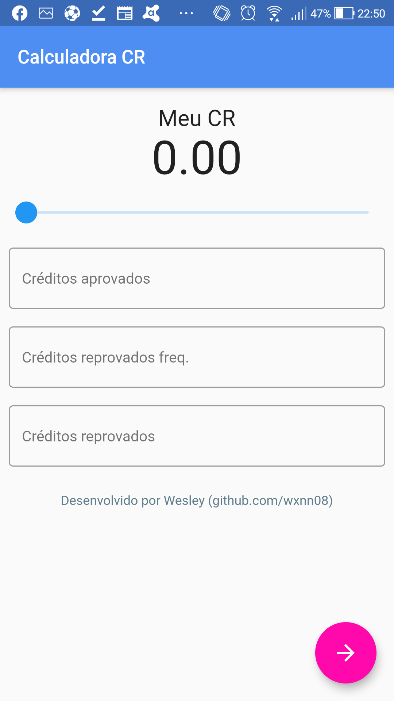
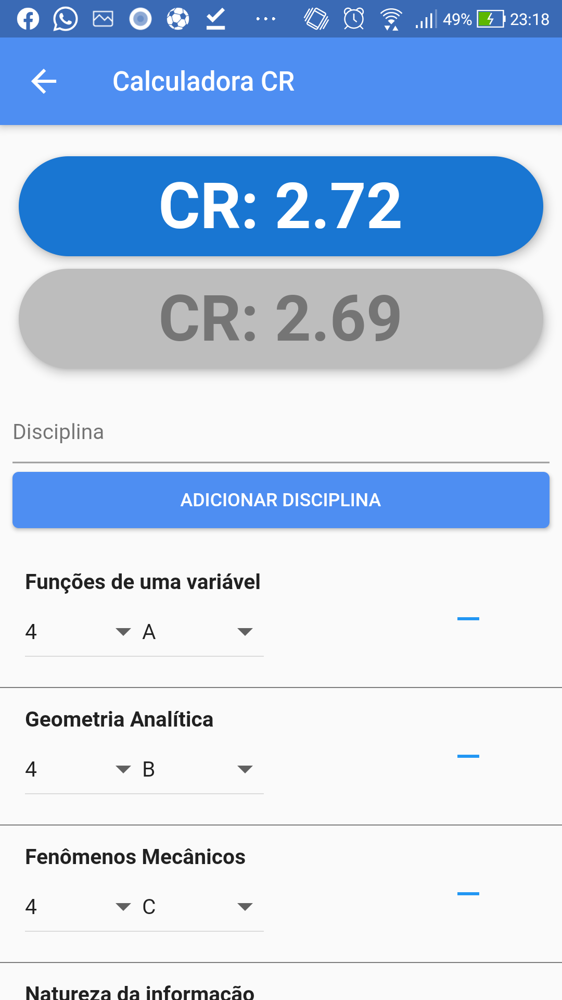

# APP: CR Calculadora

O aplicativo CR Calculadora é um simulador de CR. Com ele você pode antecipar a alegria (ou tristeza) do próximo quadrimestre e não ter mais que esperar os professores voltarem do churrasco para só assim atualizar as notas no portal do aluno. 
Você também pode simular você no seu ápice de aproveitamento, tirando A em todas as disciplinas para depois dizer: "Só aumentou 0.1?".

Divirta-se!

## Telas

